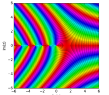
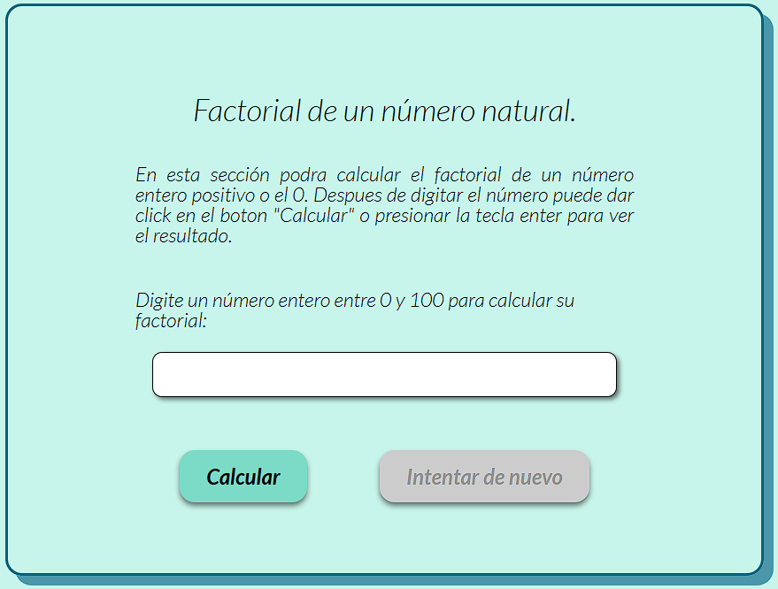
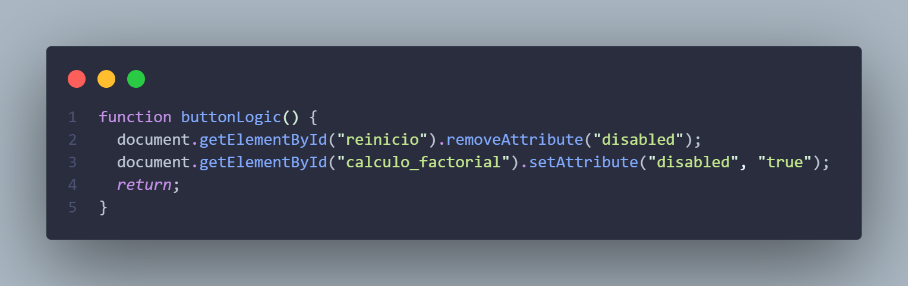
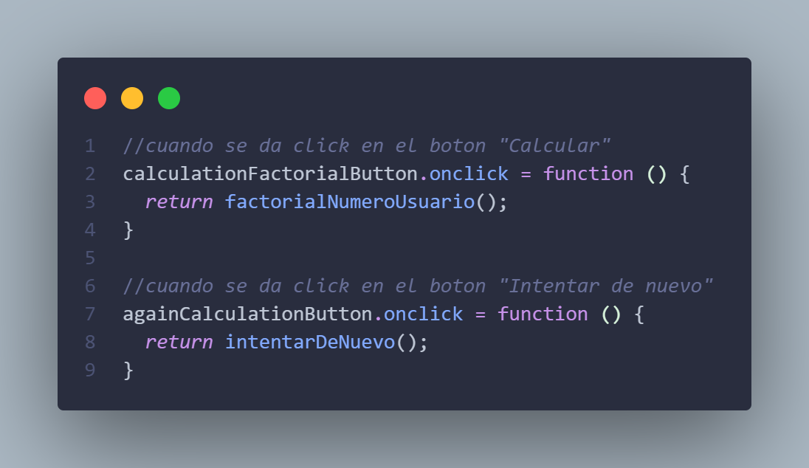
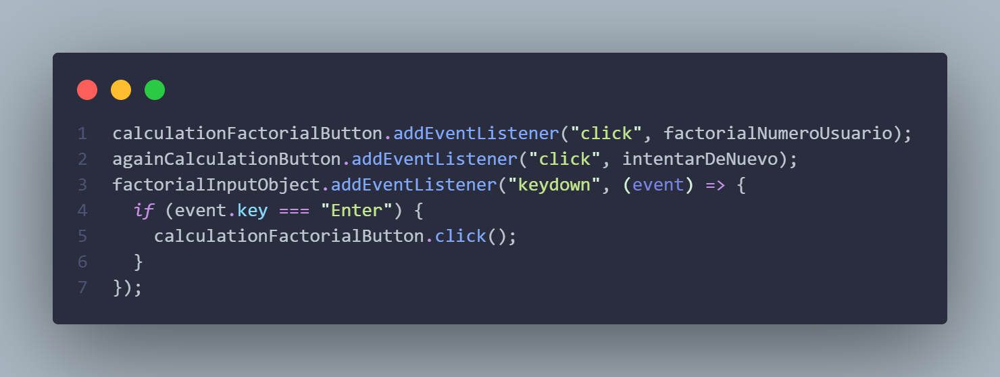

<h1 align="center">La Función factorial 🔢📈</h1>

    

En esta pagina se habla un poco de la interesante `función factorial`, desde su definición matematica, un valor curioso como el cero factorial, su extención análitica al plano de los números reales y complejos, también al final hay un apartado para calcular el factorial de un número entero entre 1 y 100 implementando conocimientos de logica de programación.

## Tecnologías 💻

Para este proyecto landing page solo se utilizaron las tres tecnologias principales de un pagina web:

- HTML 5
- CSS 3
- JavaScrpit

## Funcionalidades 🛠️

### Sección calcular factorial

Al ingresar un número valido para calcular su factorial (un positivo entero o el cero) en pantalla aparecera el resultado. Entre las funcionalidades de los botones puedes dar click en el boton **Calcular** o presionar **Enter** para ver el resultado.

    

>[!NOTE]
>Los números validos son el conjunto de los enteros positivos y el cero ya que la función creada para el calculo del factorial esta diseñada solo para estos números validos.

### Logica de los botones

Los botones estaran habilitados bajo su respectiva lógica de uso, así cuando se realice un intento el boton **_Intentar de nuevo_** pasara a estar habilitado mientras que el boton **_Calcular_** se deshabilitara.\
Estas funcionalidades se logran gracias a la manipulación del atributo `disable` para botones en HTML mediante una lógica en javaScript:

    

### Funcionalidades tecnicas 
Se modifico un detalle tecnico para mejorar la estructura del código y tambien para añadir la funcionalidad de poder presionar la tecla enter y poder llamara a la función `factorialNumeroUsuario()`.

Código anterior:

    

Código reestructurado:

    

La modificación radica en implementar el método `addEventListener`, de modo que se logro capturar el evento al presionar la tecla enter y atribuirlo a la llamada de la función para calcular el factorial del número dado por el usuario; y al mismo tiempo se logro reducir seis lineas de código a solo dos.

## Futuras implementaciones
Se espera añadir una mejora en los mensajes al hacer un intento en la sección de calcular el factorial, ya que el número al ser mayor de 21 el resultado se muestra con notación cientifica, sera ideal añadir un asección abajo explicando está notación y un mensaje cuando el numero sea mayor que 21 por ejemplo:
>¡El número es tan vasto que se necesita notación cientifica!

    También se busca añadir una sección en el readme para mostrar la función creada para el calculo de un número entero positivo o el cero.

## Estado del proyecto 🚧

La pagina web aun está en desarrollo y mantenimiento para pulir detalles tecnicos, tambien para añadir contenido relevante en la pagina.

## Autor

- [Berny](https://github.com/Bernal30) ♦️